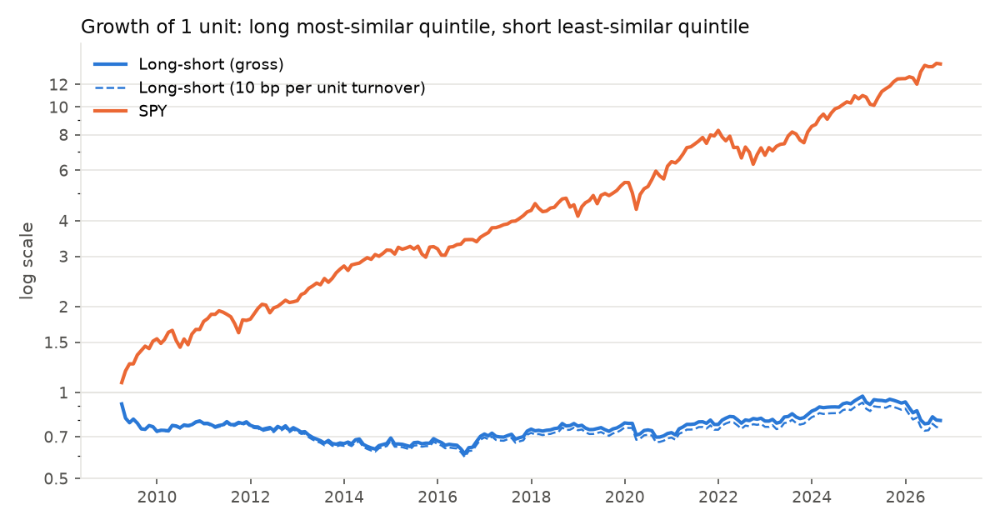
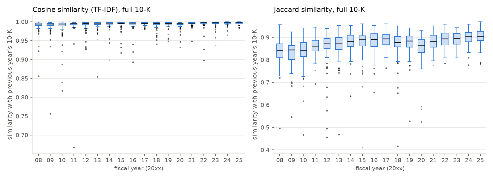
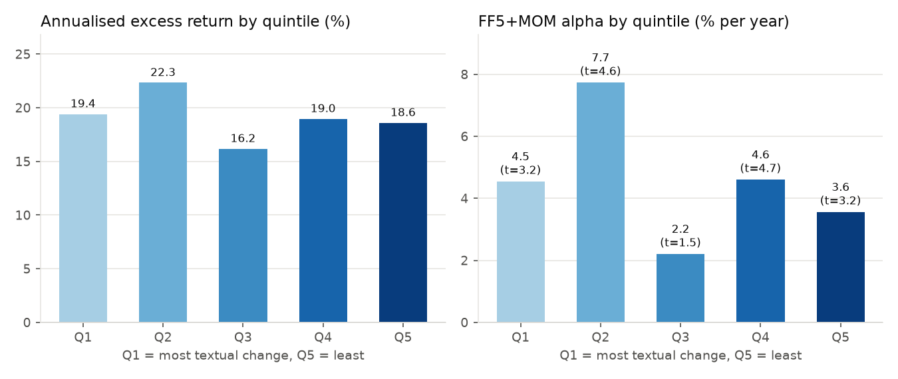
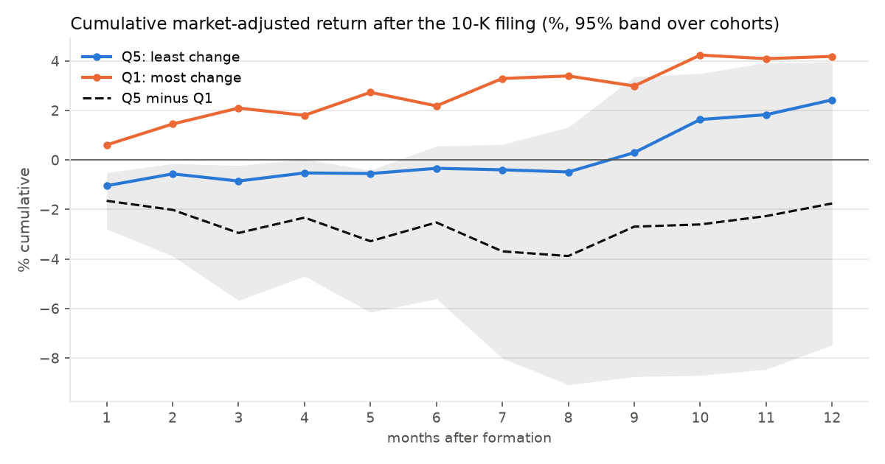
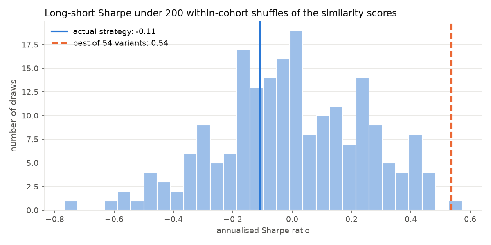
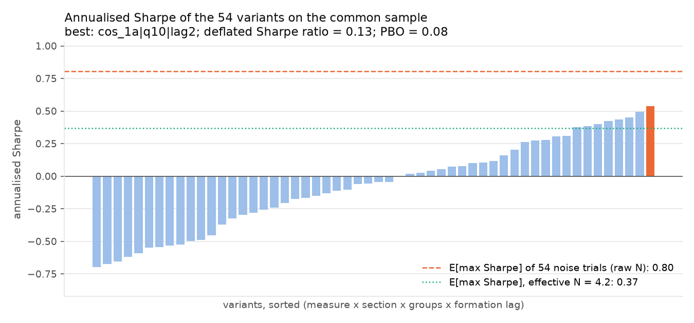

# Lazy Prices on the S&P 100

[](https://github.com/iqueipopg/lazy-prices/actions/workflows/tests.yml)
[](paper/note.pdf)
[](LICENSE)

A replication of Cohen, Malloy and Nguyen (2020), *Lazy Prices*, on the current
S&P 100 with free data (10-K texts from SEC EDGAR, yfinance prices, Kenneth
French factors), evaluated with Newey-West factor alphas, event-time abnormal
returns, a placebo test, and the selection-bias corrections of Bailey and
López de Prado (deflated Sharpe ratio, probability of backtest overfitting)
over the 54 variants that were tried.

**In 90 seconds**

- **Result: no effect on this universe and period.** Long the quintile whose
  10-K changed least, short the quintile whose 10-K changed most: -0.9% a year,
  FF5+MOM alpha -0.9% (t = -0.5), Sharpe -0.11 with a bootstrap interval of
  [-0.56, 0.38], March 2009 to September 2026.
- **Three independent checks agree.** Event-time abnormal return after twelve
  months: -1.8% (t = -0.6). Within-cohort rank correlation between text change
  and forward return: 0.03 (t = 1.1). The actual strategy sits at the 33rd
  percentile of 200 placebo runs with shuffled scores.
- **The best of 54 variants looks tempting and is not.** Annualised Sharpe
  0.54, alpha 4.3% with t = 1.3. Its deflated Sharpe ratio is 0.13: what the
  luckiest of 54 zero-skill trials would show. The only variants with |t| > 2
  have the opposite sign to the paper.
- **Why this is the expected outcome.** The universe is 100 of the most
  scrutinised firms in the world, selected after the fact for having survived
  (every quintile shows a positive alpha of 2% to 8% a year), in a period after
  the paper's publication, with a similarity measure that is essentially 1 for
  every firm every year.

The full write-up is an eleven-page research note, [paper/note.pdf](paper/note.pdf),
whose tables and every number in its text are generated from `results/` by
`python -m lazyprices.report`.



## The paper in three sentences

Firms whose annual report is nearly a copy of last year's are, on average,
firms where nothing bad is happening; firms that rewrite large parts of the
10-K are usually disclosing bad news, often in the risk factors and the MD&A.
Investors do not read the changes when they are published, so the information
leaks into prices slowly over the following months.
A portfolio that is long "non-changers" and short "changers", rebalanced as
new 10-Ks arrive and held for a year, earned 30 to 60 basis points per month
of abnormal return on the CRSP universe from 1995 to 2014.

## Data

| Source | What | Where it lands |
|---|---|---|
| LUCA cache (`luca-ai-lab/data/cache/corpus_facts`, read only) | CIK, ticker and name of the 100 companies | `data/universe.csv` |
| SEC EDGAR submissions API and Archives | 10-K primary documents, fiscal years 2007 to 2025 | `data/raw/` (6.7 GB, not in git), index in `data/filings.csv` |
| yfinance | adjusted daily closes for the 100 tickers and SPY, 2007 onward | `data/prices.csv` |
| Kenneth French Data Library | Fama-French 5 factors and momentum, daily | `data/factors_daily.csv` |

Sample sizes after processing:

| | count |
|---|---|
| Companies with at least one 10-K | 99 (Honeywell Aerospace has none yet) |
| 10-K filings downloaded (FY2007 to FY2025) | 1,792 |
| Consecutive-filing pairs with a similarity score (FY2008 to FY2025) | 1,690 |
| Pairs with Item 1A extracted in both years | 1,560 |
| Pairs with Item 7 extracted in both years | 1,297 |
| Portfolio months (March 2009 to September 2026) | 211 |
| Stocks per leg of the long-short portfolio, mean (min) | 19 (14) |

### Limitations of the data

- **Survivorship and look-ahead in the universe.** The universe is the S&P 100 *today*.
  Every company in it survived and grew into the index; firms that were in the
  index in 2010 and later shrank, were acquired or failed are absent. This is
  visible in the results: every quintile has a positive FF5+MOM alpha of 2% to 8%
  a year. The long-short difference is less exposed to this bias than either
  leg, but stocks whose 10-K changed a lot because the business was collapsing
  are exactly the ones that are missing from the short leg.
- **100 large caps.** The paper's effect is estimated on thousands of firms
  across the size distribution. Whether it survives among the 100 largest is
  exactly what this sample cannot answer with power: each quintile holds about
  19 stocks, so portfolio returns are noisy.
- **Period.** Filings from FY2007 give the first change score for FY2008 filings
  (filed in early 2009), so returns run from March 2009 to September 2026,
  entirely after the paper's sample and largely after its publication as a
  working paper (2010).
- **Predecessor registrants.** Five companies changed CIK after a holding-company
  reorganisation (Exxon Mobil, Alphabet, Disney, BlackRock, Medtronic). The
  predecessor's filings are attributed to the current ticker so that their
  history is not lost. Companies that were created or listed later (AbbVie,
  Meta, PayPal, Uber and others) enter when their second 10-K exists.
- **Item extraction is imperfect.** Item 7 is missing for 23% of pairs, mostly
  banks and a few industrials that incorporate the MD&A by reference to the
  annual report exhibit (JPMorgan, Citigroup, BNY, IBM, Chevron) or use
  headings without item numbers (Southern Co, FedEx). Item 1A is missing for
  8%. Sections shorter than 2,000 characters are treated as missing.

## Methodology

**Text.** Each primary document is converted to plain text (HTML parsed with
lxml; inline-XBRL hidden blocks and CSS-hidden elements dropped; newlines only
at block boundaries so headings are not split). Items 1A and 7 are located by
pairing every "Item 1A. Risk Factors" / "Item 7. Management's Discussion"
heading with the next "Item 1B/2" / "Item 7A/8" heading and keeping the
longest span; table-of-contents entries and cross-references produce short
spans and lose. Tokens are lower-case alphabetic words of at least two letters,
so numbers do not count as changes.

**Similarity.** For each pair of consecutive 10-Ks of the same company (report
dates 270 to 500 days apart) and each section (full document, Item 1A, Item 7):

- cosine similarity between TF-IDF vectors, where the inverse document
  frequency is computed *point in time* from all 10-Ks filed in months before
  the later filing (the score of a filing depends only on documents that were
  public when it appeared);
- Jaccard similarity between the sets of distinct terms.

The filing-by-filing table is `results/similarity.csv`. The cosine measure on
the full document is nearly saturated (median 0.996, interquartile range 0.994
to 0.998): 10-Ks of large companies are long and mostly boilerplate. Jaccard
has more dispersion (median 0.88, IQR 0.85 to 0.91) and its median rose from
0.84 in FY2008 to 0.91 in FY2025.



**Portfolios.** Filings are grouped by fiscal year (the calendar year in which
the reporting period ends, with periods ending in the first two weeks of
January assigned to the previous year). Within each fiscal-year cohort,
companies are sorted on the similarity score into quintiles; quintile 5 holds
the least-changed 10-Ks. A stock enters its quintile portfolio at the close of
the first trading day of the month after its filing date and is held for
twelve months, so a company's position is refreshed once a year and the
portfolio at any date averages the overlapping cohorts. Portfolios are
equal-weighted and rebalanced daily; the long-short portfolio is quintile 5
minus quintile 1 and is only defined on days when both legs hold at least five
stocks. Daily returns are compounded into calendar months. Transaction costs
are 10 basis points per unit of one-way turnover on each leg; realised
turnover is 3.2 per year for the two legs together, so costs are about 0.3%
a year.

Ranking within a fiscal-year cohort means that an early filer's quintile
depends on the scores of firms that file later in the same season (up to a few
months later for off-cycle filers such as Apple or Microsoft). Prices are
never used before the filing date, and the tests check this, but the ranking
itself is not strictly point in time. A fully point-in-time variant that ranks
each filing against the filings of the trailing twelve months is reported as a
robustness check.

**Evaluation.** Monthly returns of each quintile (in excess of the risk-free
rate) and of the long-short portfolio are regressed on the CAPM, Fama-French 3
and Fama-French 5 plus momentum factors with Newey-West standard errors
(automatic lag `floor(4 (T/100)^(2/9))` = 4). Sharpe ratios are annualised
from monthly returns. Alphas are annualised percentages.

**Overfitting.** The grid of variants is similarity measure (cosine, Jaccard) x
section (full, Item 1A, Item 7) x number of groups (3, 5, 10) x formation lag
(0, 1, 2 months): 54 trials. Their monthly long-short returns on the common
sample (201 months) go into `bto.deflated_sharpe_ratio` (with the observed
skewness and kurtosis of the best trial), `bto.effective_number_of_trials`
(participation ratio of the trial correlation matrix) and `bto.cscv`
(S = 16 blocks, 12,870 in-sample/out-of-sample partitions).

## Results

### Main specification: cosine TF-IDF, full document, quintiles, formation the month after filing

Long-short portfolio (Q5 minus Q1), 211 months, March 2009 to September 2026:

| | gross | net of 10 bp per unit turnover |
|---|---|---|
| Mean return (% per year) | -0.92 | -1.24 |
| Volatility (% per year) | 8.46 | 8.49 |
| Sharpe ratio | -0.11 | -0.15 |
| Sharpe ratio, 95% block-bootstrap interval | [-0.56, 0.38] | [-0.58, 0.34] |
| Maximum drawdown (%) | -33.1 | -34.7 |
| CAPM alpha (% per year), t-stat | -0.68 (-0.37) | -1.00 (-0.53) |
| FF3 alpha (% per year), t-stat | -0.42 (-0.23) | -0.73 (-0.40) |
| FF5+MOM alpha (% per year), t-stat | -0.93 (-0.49) | -1.25 (-0.65) |

SPY over the same months: Sharpe ratio 1.02.

### By quintile (excess returns over the risk-free rate)

| Quintile | Mean (% p.a.) | Vol (% p.a.) | Sharpe | Max DD (%) | CAPM alpha (t) | FF3 alpha (t) | FF5+MOM alpha (t) |
|---|---|---|---|---|---|---|---|
| Q1, most change | 19.4 | 16.5 | 1.17 | -23.0 | 4.42 (3.00) | 4.18 (2.93) | 4.54 (3.15) |
| Q2 | 22.3 | 16.3 | 1.37 | -21.5 | 7.48 (4.24) | 7.36 (4.33) | 7.73 (4.62) |
| Q3 | 16.2 | 14.6 | 1.10 | -21.4 | 2.84 (1.89) | 2.34 (1.65) | 2.20 (1.54) |
| Q4 | 19.0 | 15.3 | 1.24 | -26.4 | 4.61 (4.34) | 4.39 (4.09) | 4.60 (4.69) |
| Q5, least change | 18.6 | 16.2 | 1.15 | -28.5 | 3.66 (2.26) | 3.67 (3.30) | 3.55 (3.18) |

There is no monotonic pattern across quintiles. The positive alpha in every
quintile is the survivorship signature described above, not a feature of the
strategy.



### Robustness of the main specification

| Specification | Months | Mean (% p.a.) | Sharpe | FF5+MOM alpha (t) |
|---|---|---|---|---|
| Main | 211 | -0.92 | -0.11 | -0.93 (-0.49) |
| Trailing-window ranking (fully point in time) | 214 | -1.48 | -0.15 | -2.73 (-0.87) |
| Main, 2009 to 2016 | 94 | -3.85 | -0.43 | -1.27 (-0.52) |
| Main, 2017 to 2026 | 117 | 1.44 | 0.18 | 2.09 (1.09) |

A model-free check (`results/rank_correlations.csv`): within each fiscal-year
cohort, the Spearman correlation between the similarity score and the stock's
return over the following twelve months, averaged over the 17 cohorts.

| Score | Mean rank correlation | t-stat | Years positive |
|---|---|---|---|
| Cosine, full document | 0.035 | 1.14 | 12 of 17 |
| Jaccard, full document | 0.034 | 0.93 | 11 of 17 |
| Cosine, Item 1A | 0.041 | 1.00 | 11 of 17 |
| Jaccard, Item 1A | -0.006 | -0.15 | 9 of 17 |
| Cosine, Item 7 | 0.006 | 0.18 | 10 of 17 |
| Jaccard, Item 7 | -0.010 | -0.30 | 10 of 17 |

The sign is the paper's (more similar, higher return) for the full document
and for cosine on Item 1A, but the magnitude is tiny and none of the
correlations is distinguishable from zero.

### Event time

The paper's central figure is the cumulative abnormal return in the months
after the filing. Here, for every filing in the main specification, the
market-adjusted (minus SPY) return is cumulated month by month from formation;
averages are taken first within and then across the 17 fiscal-year cohorts, so
the standard error treats each cohort as one observation
(`results/event_time.csv`).

| Month after formation | Q1 (most change) | Q5 (least change) | Q5 minus Q1 | s.e. |
|---|---|---|---|---|
| 3 | 2.1% | -0.9% | -3.0% | 1.4% |
| 6 | 2.2% | -0.3% | -2.5% | 1.6% |
| 12 | 4.2% | 2.4% | -1.8% | 2.9% |

Both extreme quintiles beat SPY (equal-weighted survivors against a
cap-weighted index); their difference has the opposite sign to the paper and
is inside the noise.



### Placebo

The main specification is re-run 200 times with the similarity scores
permuted within each fiscal-year cohort. Every breakpoint and every cohort's
score distribution is unchanged; only the link between text and company is
broken (`results/placebo.csv`, `results/placebo_summary.json`).

| | value |
|---|---|
| Placebo Sharpe, mean and standard deviation | 0.00, 0.25 |
| Placebo Sharpe, 5th to 95th percentile | -0.42 to 0.40 |
| Actual strategy's percentile in the placebo distribution | 33rd |
| Share of placebo runs with \|t\| > 2 on the FF5+MOM alpha | 6% |
| Best of 54 variants' percentile in the placebo distribution | 99.5th |

The last row is the trap: the best variant beats almost every *single*
placebo run, which is why it must be compared with the maximum of 54 trials,
as the deflated Sharpe ratio does, and not with one draw.



### Overfitting evaluation over the 54 variants

| | value |
|---|---|
| Variants tried | 54 |
| Variants with a positive Sharpe ratio | 17 |
| Variants with \|t\| > 2 on the FF5+MOM alpha | 8, all Jaccard Item 7 variants with *negative* alpha |
| Best variant (common sample, 201 months) | cosine, Item 1A, deciles, 2-month lag |
| Annualised Sharpe of the best variant / median variant | 0.54 / -0.05 |
| Expected maximum Sharpe of 54 zero-skill trials | 0.80 |
| **Deflated Sharpe ratio, raw N = 54** | **0.13** |
| Effective number of independent trials (participation ratio) | 4.2 |
| Expected maximum Sharpe of 4.2 zero-skill trials | 0.37 |
| Deflated Sharpe ratio, effective N | 0.76 |
| Probability of backtest overfitting (CSCV, S = 16) | 0.08 |
| Probability that the in-sample winner loses money out of sample | 0.21 |



The best variant's Sharpe of 0.54 is below what the luckiest of 54 noise
strategies would show (0.80): the deflated Sharpe ratio is 0.13 against a
certification threshold of 0.95. Even against the lenient null of 4.2
independent trials it is 0.76. On its own full sample the best variant has an
FF5+MOM alpha of 4.3% a year with t = 1.34 and a maximum drawdown of 41%.

The low PBO (0.08) says something different and should not be read as
reassurance: CSCV asks whether the in-sample winner keeps ranking well
*relative to the other variants* out of sample. It does, because the Item 7
variants are consistently the worst and the Item 1A cosine variants are
consistently the least bad, so relative rankings are stable. PBO measures
overfitting within the search; it does not say the winner is profitable.

The Item 7 variants deserve a note. All 18 of them have negative Sharpe
ratios, and the worst (Jaccard, Item 7, quintiles, no lag) loses 10% a year
with an FF5+MOM alpha of -9.3% (t = -2.57) and an 85% drawdown. That is the
opposite of the paper: among these 100 firms, the ones that rewrote their MD&A
the most did better over the next year. The rank correlations for Item 7 are
zero, so this is a tail effect concentrated in the extreme groups, on a
subsample (1,297 pairs) that excludes the banks whose MD&A is incorporated by
reference. With 54 trials, eight of them at |t| > 2 in the wrong direction is
not evidence of a reverse effect either; it is what dispersion across
correlated trials looks like.

## What I would conclude

1. On the current S&P 100 from 2009 to 2026 there is no detectable Lazy Prices
   effect. The main specification's alpha is slightly negative and
   indistinguishable from zero under every factor model, with or without
   costs, and the model-free rank correlations are near zero.
2. This is not a rejection of the paper. Its effect is estimated on a broad
   universe of thousands of firms in a period before the idea was published. Here the universe is 100 of the most scrutinised
   companies in the world, selected after the fact for having survived, and
   the period is after publication. A null result in this setting is what the
   paper's own mechanism (slow attention) would predict for firms with the
   most attention.
3. The measurement itself is weak for this universe. Cosine similarity on the
   full document is essentially 1 for every firm every year; the sorts are
   made on the third decimal. Item-level measures help a little, but the
   sections are not always extractable.
4. Searching over 54 variants produces a best backtest with an annualised
   Sharpe of 0.54 that would be tempting to report on its own. The deflated
   Sharpe ratio of 0.13 says it is exactly what one should expect from the
   luckiest of 54 noise trials.

## Repository layout

```
lazyprices/
  edgar.py       universe from the LUCA cache, EDGAR submissions and 10-K download with cache and rate limit
  text.py        HTML to text, item extraction, TF-IDF cosine and Jaccard similarity (point-in-time IDF)
  data.py        yfinance prices, Kenneth French factors
  portfolio.py   cohort ranking, formation calendar, equal-weighted overlapping portfolios, costs
  evaluation.py  Newey-West alphas, Sharpe, drawdown, DSR / PBO via bto, rank correlations
  diagnostics.py event-time abnormal returns, placebo with shuffled scores, block-bootstrap Sharpe interval
  figures.py     the six figures
  report.py      LaTeX tables and number macros for the note, generated from results/
  __main__.py    the pipeline
tests/           27 tests, no network: similarity values on synthetic texts, item extraction,
                 quantile formation, no look-ahead in the formation calendar and in event time,
                 alpha recovery, placebo shuffling, bootstrap interval
paper/           note.tex and note.pdf (eleven pages, single column), generated/*.tex
results/         similarity.csv, portfolio_monthly.csv, quintile_table.csv, alphas.csv, robustness.csv,
                 trials.csv, trials_monthly.csv, rank_correlations.csv, overfitting.json, event_time.csv,
                 placebo.csv, placebo_summary.json, summary.json
figures/         cumulative_long_short_vs_spy.png, quintile_returns.png, similarity_by_year.png,
                 dsr_trials.png, event_time_car.png, placebo_sharpe.png
data/            universe.csv, filings.csv, prices.csv, factors_daily.csv (raw and processed text are not committed)
```

## Run it

```bash
pip install -r requirements.txt      # includes bto from github.com/iqueipopg/backtest-overfitting
pytest -q                            # 27 tests, no network
ruff check lazyprices tests          # lint, also run in CI
python -m lazyprices                 # full pipeline; every stage is cached
python -m lazyprices.report          # regenerate the note's tables from results/
cd paper && pdflatex note.tex && pdflatex note.tex
```

The first run downloads about 6.7 GB of 10-K documents from EDGAR (about 5
minutes at 8 requests per second with 4 threads), cleans them (about 10
minutes) and computes similarities (about 1 minute). With the cached
`results/similarity.csv`, `data/prices.csv` and `data/factors_daily.csv` in the
repository, `python -m lazyprices` reproduces every table and figure in about
two minutes without touching EDGAR (most of it the 200 placebo runs). The EDGAR client sends the identifying
`User-Agent` the SEC requires; change it in `lazyprices/config.py` or through
the `SEC_USER_AGENT` environment variable before running the download
yourself.

## Decisions that are not in the paper

- FY2007 filings are downloaded only to serve as the predecessor of FY2008.
- One filing per company and fiscal year; 10-K/A amendments are ignored.
- IDF weights are computed point in time (documents filed in earlier months
  only). In the first months of the sample this reduces to a plain
  term-frequency cosine.
- Positions are established at the close of the first trading day of the
  month after the filing and earn returns from the next day; exit is at the
  close of the first trading day twelve months later.
- The long-short return is undefined when either leg has fewer than five
  stocks, which removes the last months of 2008 when only off-cycle filers had
  a score.
- Trading costs are a flat 10 basis points per unit of one-way turnover on
  each leg; there is no borrowing cost on the short leg.

## References

- Cohen, L., Malloy, C. and Nguyen, Q. (2020). Lazy Prices. *Journal of Finance*, 75(3), 1371-1415.
- Bailey, D. H. and López de Prado, M. (2014). The Deflated Sharpe Ratio: Correcting for Selection Bias, Backtest Overfitting and Non-Normality. *Journal of Portfolio Management*, 40(5), 94-107.
- Bailey, D. H., Borwein, J. M., López de Prado, M. and Zhu, Q. J. (2017). The Probability of Backtest Overfitting. *Journal of Computational Finance*, 20(4), 39-69.
- Fama, E. F. and French, K. R. (2015). A five-factor asset pricing model. *Journal of Financial Economics*, 116(1), 1-22.
- Newey, W. K. and West, K. D. (1994). Automatic Lag Selection in Covariance Matrix Estimation. *Review of Economic Studies*, 61(4), 631-653.

## License

MIT, Ignacio Queipo de Llano.
